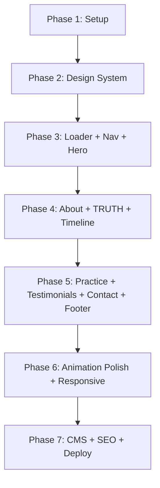

# Hubrah Siddiqui — Luxury Legal Portfolio Website
## Implementation Plan

---

## Project Overview

| Aspect | Detail |
|---|---|
| **Client** | Hubrah Siddiqui — Advocate High Court, Mediator, Corporate Trainer |
| **Type** | Luxury personal branding portfolio website |
| **Stack** | Next.js 14+, Tailwind CSS, GSAP 3+, Lucide React, Sanity CMS |
| **Design** | Asymmetric layouts, glassmorphism, navy/cream/gold palette |
| **Sections** | 10 (Loader → Nav → Hero → About → TRUTH → Timeline → Practice → Testimonials → Contact → Footer) |

> [!IMPORTANT]
> The site is **portfolio-focused** — no blog, no interactive tools. Pro-bono/TRUTH section is as prominent as practice areas.

---

## Phase 1: Project Foundation & Setup

**Goal**: Initialize Next.js project, install dependencies, configure Tailwind, set up file structure.

### Tasks
- [ ] Initialize Next.js 14+ app with App Router
- [ ] Install dependencies: `gsap`, `lucide-react`, `next-sanity`
- [ ] Configure Tailwind CSS with custom color palette
- [ ] Set up Google Fonts (Playfair Display + Inter)
- [ ] Create project directory structure:
  ```
  src/
  ├── app/
  │   ├── layout.tsx
  │   ├── page.tsx
  │   ├── globals.css
  │   └── api/contact/route.ts
  ├── components/
  │   ├── PageLoader.tsx
  │   ├── Navbar.tsx
  │   ├── Hero.tsx
  │   ├── About.tsx
  │   ├── TruthProject.tsx
  │   ├── ExperienceTimeline.tsx
  │   ├── PracticeAreas.tsx
  │   ├── Testimonials.tsx
  │   ├── Contact.tsx
  │   └── Footer.tsx
  ├── lib/
  │   ├── sanity.ts
  │   └── fallback-data.ts
  └── hooks/
      └── useScrollAnimation.ts
  ```
- [ ] Create `.env.local` template for Sanity + email credentials
- [ ] Set up SEO metadata in layout.tsx

### Image Asset Sources (Unsplash URLs with Fallbacks)
- [ ] Hero background: Use Unsplash URL (1920×1080, legal/justice theme)
  Fallback: `https://images.unsplash.com/photo-1589578527966-63d60b47a486?w=1920&h=1080&fit=crop`
- [ ] About portrait: Use Unsplash URL (400×500, professional headshot)
  Fallback: `https://images.unsplash.com/photo-1494790108377-be9c29b29330?w=400&h=500&fit=crop`
- [ ] TRUTH section image: Use Unsplash URL (600×600, justice/cause related)
  Fallback: `https://images.unsplash.com/photo-1555859496-82d76e52e4f5?w=600&h=600&fit=crop`
- [ ] All Unsplash URLs stored in `lib/fallback-data.ts`
- [ ] Images lazy-loaded with Next.js Image component
- [ ] WebP format with JPEG fallback in production

---

## Phase 2: Design System & Global Styles

**Goal**: Establish the complete design system — colors, typography, glassmorphism utilities, animations base.

### Design Tokens (Tailwind Config)
```
Primary Navy:   #0B1F3A
Warm Cream:     #F5F1E8
Gold Accent:    #D4AF37
Soft Borders:   rgba(245, 241, 232, 0.1)
```

### Tasks
- [ ] Configure Tailwind `extend` with custom colors, fonts, and spacing
- [ ] Write `globals.css` with:
  - CSS custom properties for the palette
  - Glassmorphism utility classes (`.glass-card`, `.glass-nav`)
  - Rich gradient backgrounds (radial, not flat)
  - Ring border utilities at various opacities
  - Typography scale (display serif + body sans-serif)
  - Smooth scroll behavior
  - Custom scrollbar styling
- [ ] Import Playfair Display (serif) + Inter (sans-serif) via `next/font/google`

---

## Phase 3: Core Sections — Part 1 (Loader → Hero → Nav)

**Goal**: Build the first-impression sections that set the luxury tone.

### 3A. Page Loader
- [ ] Full-screen navy overlay
- [ ] Center text: "Hubrah Siddiqui" + "Advocate High Court" (Playfair Display, cream)
- [ ] GSAP timeline: text fade-in → hold 1s → fade-out overlay (total ~2s)
- [ ] Optional subtle line animation beneath text
- [ ] Remove from DOM after animation completes

### 3B. Navigation Bar
- [ ] Sticky top, glassmorphic background (`backdrop-blur-xl`, ring border)
- [ ] Logo/Name left, nav links right
- [ ] 7 links: Overview, About, Pro-Bono, Experience, Practice, Testimonials, Contact
- [ ] Active link underline with smooth animation (IntersectionObserver tracking)
- [ ] Mobile: hamburger icon → sliding drawer (same glass style)
- [ ] Smooth scroll on click with offset for sticky nav

### 3C. Hero Section
- [ ] Background image with dark navy overlay (20-30% opacity)
- [ ] Asymmetric text layout: headline left (60%), supporting right (40%)
- [ ] Headline: "Expert Legal Strategy. Unwavering Integrity." (serif, 48-72px)
- [ ] 4 stats cards (ring border, no fill, cream text)
- [ ] Primary CTA: "Schedule Call" (cream bg, navy text, gold hover glow)
- [ ] Secondary CTA: "View Practice Areas" (transparent, cream border)
- [ ] GSAP entrance animations: staggered text + cards reveal
- [ ] Generate hero background image via AI

---

## Phase 4: Core Sections — Part 2 (About → TRUTH → Timeline)

**Goal**: Build the credibility and values sections.

### 4A. About Section
- [ ] Asymmetric two-column: portrait left (60%), copy right (40%)
- [ ] Portrait with subtle ring border effect
- [ ] Headline: "Calm, Structured, Unflinching"
- [ ] Body paragraph + 6 bullet points (70% opacity cream)
- [ ] GSAP scroll-triggered fade-in, staggered bullets (100ms delay each)
- [ ] Generate professional portrait placeholder

### 4B. Project TRUTH Section
- [ ] Full-width with asymmetric card layout
- [ ] Left (50%): Headline with gold accent on "T", subheading, body copy, tagline
- [ ] Right (50%): Impact stats cards (4 items)
- [ ] Background: navy-to-deep-navy gradient with gold tint
- [ ] Ring border around section
- [ ] GSAP parallax background + staggered text fade-in
- [ ] Generate justice/cause imagery

### 4C. Experience Timeline
- [ ] Vertical asymmetric timeline with connector line
- [ ] 4 timeline cards: role, org, period (gold accent), achievements
- [ ] Alternating left/right stagger
- [ ] Hover: subtle glow + scale(1.02)
- [ ] GSAP scroll-triggered card reveals
- [ ] Mobile: single-column stack

---

## Phase 5: Core Sections — Part 3 (Practice → Testimonials → Contact → Footer)

**Goal**: Build the service showcase, social proof, and CTA sections.

### 5A. Practice Areas
- [ ] 6 service cards in 2×3 asymmetric grid (staggered offsets)
- [ ] Card: navy bg, ring border, serif heading, sans-serif description, Lucide icon
- [ ] Hover: scale(1.03), gold box-shadow glow, border brightens
- [ ] 6 icons: Building2, Scale, FileText, Shield, Handshake, Users
- [ ] Mobile: single-column stack
- [ ] GSAP staggered cascade on scroll

### 5B. Testimonials
- [ ] 3-4 cards in asymmetric masonry (staggered vertical offsets: 0, 40px, 80px, 0)
- [ ] Gold quotation mark icon (60×60, 30% opacity)
- [ ] Quote text (serif, italic), attribution (bold name + context)
- [ ] No hover effect (refined simplicity)
- [ ] GSAP fade-in on scroll

### 5C. Contact Section
- [ ] Headline: "Schedule a Consultation" (serif)
- [ ] Form: Name, Email, Practice Area dropdown, Message textarea
- [ ] Submit button: cream bg, navy text, gold hover glow
- [ ] Contact info: phone, email, location with icons
- [ ] Background: navy with gold undertone gradient
- [ ] API route `/api/contact` for form handling
- [ ] Success/error state management

### 5D. Footer
- [ ] Three columns: credentials | quick links + copyright | social links
- [ ] Dark navy, cream text, 70% opacity
- [ ] Top border: cream ring, 0.1 opacity
- [ ] Social: LinkedIn, Email, Calendly

---

## Phase 6: Animation Polish & Responsive Design

**Goal**: Refine all animations and ensure flawless responsive behavior.

### Animations
- [ ] Create `useScrollAnimation` hook (IntersectionObserver + GSAP)
- [ ] Page loader timeline (text reveal → overlay fade)
- [ ] Hero: staggered text + stats card entrance
- [ ] About: fade-in portrait + staggered bullets
- [ ] TRUTH: parallax bg + left-to-right text reveal
- [ ] Timeline: sequential card reveals on scroll
- [ ] Practice cards: staggered cascade
- [ ] Testimonials: fade-in
- [ ] All animations < 600ms, easing: `power2.inOut`

### Responsive Breakpoints
- [ ] **Mobile** (320px–640px): single column, stacked layouts, hamburger nav
- [ ] **Tablet** (641px–1024px): adjusted columns, reduced spacing
- [ ] **Desktop** (1025px–1440px): full asymmetric layouts
- [ ] **Wide** (1441px–2560px): max-width container, centered
- [ ] Test touch targets (48px minimum)
- [ ] Test font scaling and readability

---

## Phase 7: CMS Integration, SEO & Deployment

**Goal**: Wire up Sanity CMS, optimize SEO, prepare for deployment.

### Sanity CMS
- [ ] Create Sanity client utility (`lib/sanity.ts`)
- [ ] Define all 10 schemas:
  - [ ] `hero` — Background image, headline, subheading, stats array, CTA text & link
  - [ ] `about` — Portrait image, headline, body text, bullets array
  - [ ] `truth` — Headline, subheading, body text, image, tagline, impact stats array
  - [ ] `experience` — Timeline array (period, title, org, achievements array)
  - [ ] `services` — Cards array (title, description, icon name)
  - [ ] `testimonials` — Quotes array (quote, author, context)
  - [ ] `contact` — Headline, subheading, email, phone, location
  - [ ] `footer` — Credentials array, social links array
  - [ ] `navigation` — Nav items array (id, label)
  - [ ] `pageLoader` — Headline text, tagline
- [ ] Implement fetch functions with try/catch fallbacks
- [ ] Store all fallback data in `lib/fallback-data.ts`

### Email Service Configuration (EmailJS)
- [ ] Sign up at emailjs.com and create free account
- [ ] Create email service in EmailJS dashboard
- [ ] Create email template with variables: `{from_name}`, `{from_email}`, `{practice_area}`, `{message}`
- [ ] Get Service ID, Template ID, and Public Key from EmailJS
- [ ] Add to `.env.local`:
  - `NEXT_PUBLIC_EMAILJS_SERVICE_ID=service_xxx`
  - `NEXT_PUBLIC_EMAILJS_TEMPLATE_ID=template_xxx`
  - `NEXT_PUBLIC_EMAILJS_PUBLIC_KEY=public_key_xxx`
- [ ] Implement EmailJS initialization in `/api/contact/route.ts`
- [ ] Test form submission before deploy

### SEO & Performance
- [ ] Meta tags: title, description, Open Graph, Twitter Card
- [ ] Schema.org structured data for legal professional
- [ ] Next.js Image optimization with lazy loading
- [ ] Dynamic imports for heavy components (GSAP)
- [ ] Lighthouse audit: target 90+ across all metrics

### Deployment
- [ ] `.env.local` template with all required variables
- [ ] Production build test
- [ ] Vercel deployment configuration

---

## Execution Order



> [!NOTE]
> Each phase will be built incrementally with the dev server running, allowing visual verification at every step.

---

## Key Design Decisions

| Decision | Choice | Rationale |
|---|---|---|
| **Framework** | Next.js 14 App Router | SSR, image optimization, API routes, Sanity integration |
| **Animation** | GSAP 3+ | More control than Framer Motion for scroll-based effects |
| **Styling** | Tailwind CSS | Matches prompt spec; rapid utility-first development |
| **CMS** | Sanity with fallbacks | Content editable post-launch; works without CMS initially |
| **Icons** | Lucide React | Lightweight, matches prompt's icon requirements |
| **Fonts** | Playfair Display + Inter | Luxury serif + clean sans-serif pairing |

---

**Ready to proceed?** Please review and confirm, or suggest any changes before I begin Phase 1.
